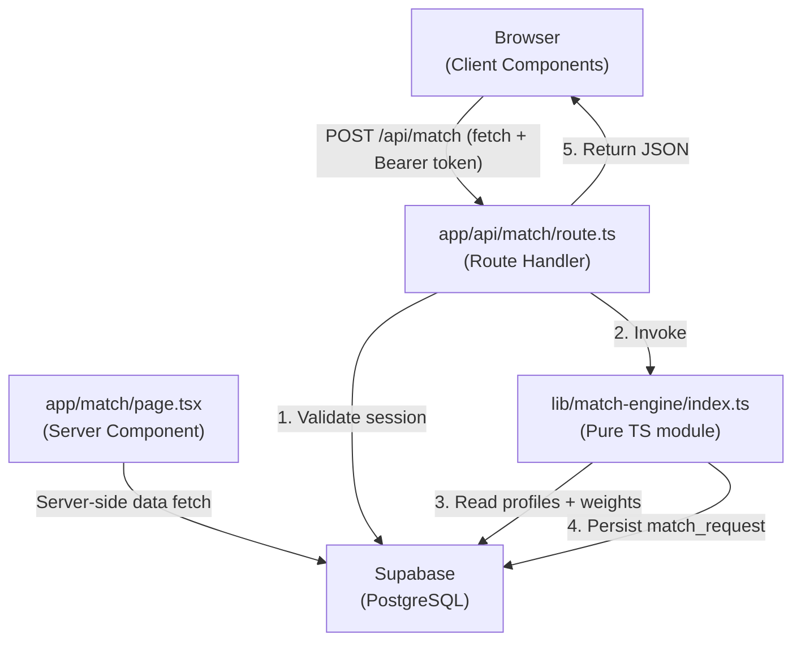

# Design Document — Connexus Student Collaboration Matcher

## Overview

Connexus is a UST student collaboration platform built on **Next.js 16 (App Router)**, **Supabase**, and **Tailwind CSS 4**. This document covers the technical design for the core Match Algorithm feature: a server-side engine that accepts a requesting student's profile, scores every eligible candidate across four weighted dimensions, and returns a ranked list of compatible collaborators.

The UI presents results as a card-based layout with a circular score-ring visualisation, dark/light mode toggle, and a mobile-first responsive design using UST gold (`#F5A623`) as the primary accent colour. All interactive components are WCAG 2.1 AA compliant.

### Key Design Decisions

| Decision | Choice | Rationale |
|---|---|---|
| Scoring runs server-side | Route Handler (`app/api/match/route.ts`) | Keeps weight config and DB credentials off the client |
| Supabase auth validation | `createServerClient` + `Authorization` header | Req 10.6 — 401 on missing/invalid token |
| Tailwind version | v4 (`@import 'tailwindcss'`) | Matches installed `@tailwindcss/postcss ^4` |
| Dark mode strategy | CSS class strategy (`dark:` variants) | Controlled by a `ThemeProvider` Client Component |
| Score ring | SVG `stroke-dasharray` / `stroke-dashoffset` | No canvas dependency; animatable with CSS transitions |
| PBT library | `fast-check` | Mature, TypeScript-native, runs in Node/Vitest |

---

## Architecture

### High-Level Data Flow



### Directory Structure

```
app/
  api/
    match/
      route.ts              # POST /api/match Route Handler
  match/
    page.tsx                # Server Component — match page shell
    loading.tsx             # Suspense fallback skeleton
  layout.tsx                # Root layout — ThemeProvider wrapper
  globals.css               # @import 'tailwindcss' + CSS custom properties

components/
  match/
    MatchResultsList.tsx    # Client Component — list container
    MatchCard.tsx           # Client Component — individual result card
    ScoreRing.tsx           # Client Component — SVG score ring
    MatchForm.tsx           # Client Component — filter form
  ui/
    ModeToggle.tsx          # Client Component — dark/light toggle
    ThemeProvider.tsx       # Client Component — theme context

lib/
  match-engine/
    index.ts                # Public API: runMatchEngine()
    scoring.ts              # Pure scoring functions
    filtering.ts            # Candidate pool filtering
    types.ts                # Shared TypeScript interfaces
  supabase/
    server.ts               # createServerClient helper
    client.ts               # createBrowserClient helper
```

---

## Components and Interfaces

### TypeScript Interfaces (`lib/match-engine/types.ts`)

```typescript
export interface Profile {
  id: string;                          // UUID
  user_id: string;                     // UUID — FK to auth.users
  full_name: string;
  college: string;
  program: string;
  year_level: number;                  // 1–5
  skill_tags: string[];                // lowercase normalised
  interest_tags: string[];             // lowercase normalised
  project_needs: ProjectNeed[];
  availability_hours_per_week: number;
  is_active: boolean;
  updated_at: string;                  // ISO 8601 timestamptz
}

export interface ProjectNeed {
  role: string;
  required_skills: string[];           // lowercase normalised
}

export interface WeightConfig {
  id: string;
  course_weight: number;
  skills_weight: number;
  interests_weight: number;
  project_needs_weight: number;
  is_active: boolean;
}

export interface ScoreBreakdown {
  course_score: number;       // [0, 1]
  skills_score: number;       // [0, 1]
  interests_score: number;    // [0, 1]
  project_needs_score: number; // [0, 1]
}

export interface RankedResult {
  candidate_id: string;
  full_name: string;
  college: string;
  program: string;
  year_level: number;
  skill_tags: string[];
  interest_tags: string[];
  availability_hours_per_week: number;
  score: number;              // [0, 100], 2 decimal places
  score_breakdown: ScoreBreakdown;
}

export interface MatchRequest {
  requester_id: string;
  min_availability_hours?: number;
  limit?: number;             // default 10, range [1, 50]
}

export interface MatchResult {
  results: RankedResult[];
  total_candidates_evaluated: number;
  weight_snapshot: Omit<WeightConfig, 'id' | 'is_active'>;
}
```

### Match Engine Public API (`lib/match-engine/index.ts`)

```typescript
/**
 * Entry point for the Match Engine.
 * Fetches profiles and weights from Supabase, computes scores,
 * persists the match_request record, and returns ranked results.
 *
 * All scoring is deterministic: given the same inputs, the output
 * is always identical (Requirement 11).
 */
export async function runMatchEngine(
  supabase: SupabaseClient,
  request: MatchRequest
): Promise<MatchResult>
```

### Scoring Functions (`lib/match-engine/scoring.ts`)

```typescript
/** Returns 1.0 | 0.6 | 0.0 — case-insensitive, whitespace-trimmed */
export function computeCourseScore(
  requesterProgram: string,
  requesterCollege: string,
  candidateProgram: string,
  candidateCollege: string
): number

/** Jaccard similarity of two tag arrays; empty ∩ empty → 0.0 */
export function computeJaccardScore(
  tagsA: string[],
  tagsB: string[]
): number

/** Fraction of requester project_needs fully satisfied by candidate */
export function computeProjectNeedsScore(
  requesterNeeds: ProjectNeed[],
  candidateSkillTags: string[]
): number

/** Weighted aggregation → [0, 100] rounded to 2 dp */
export function computeWeightedScore(
  breakdown: ScoreBreakdown,
  weights: WeightConfig
): number

/** Normalise a tag string: trim + lowercase */
export function normaliseTag(tag: string): string
```

### UI Components

#### `ScoreRing` (Client Component)

Renders an SVG circular progress ring showing the compatibility score.

```typescript
interface ScoreRingProps {
  score: number;        // 0–100
  size?: number;        // px, default 80
  strokeWidth?: number; // default 6
  animate?: boolean;    // CSS transition on mount
}
```

The ring uses two concentric `<circle>` elements. The track circle is always full; the progress circle uses `stroke-dasharray = circumference` and `stroke-dashoffset = circumference * (1 - score/100)`. The accent colour is UST gold (`#F5A623`). The score label inside the ring uses `aria-label` for screen readers.

#### `MatchCard` (Client Component)

```typescript
interface MatchCardProps {
  result: RankedResult;
  index: number;        // for staggered animation delay
}
```

Card layout (mobile-first):
- Top row: `ScoreRing` (left) + name, program, college (right)
- Tag rows: skill chips + interest chips
- Footer: availability badge + year level

#### `MatchResultsList` (Client Component)

Receives `results: RankedResult[]` as a prop from the Server Component parent. Renders a responsive grid (`grid-cols-1 sm:grid-cols-2 lg:grid-cols-3`) of `MatchCard` components with staggered entrance animations.

#### `ModeToggle` (Client Component)

Toggles `dark` class on `<html>` element. Persists preference to `localStorage`. Uses `aria-pressed` and a visible label for accessibility.

#### `ThemeProvider` (Client Component)

Wraps the app in a React context that reads the initial theme from `localStorage` (or `prefers-color-scheme`) and applies the `dark` class to `<html>` before first paint to avoid flash.

---

## Data Models

### SQL DDL

```sql
-- Enable UUID generation
create extension if not exists "pgcrypto";

-- ─── profiles ────────────────────────────────────────────────────────────────
create table public.profiles (
  id                          uuid primary key default gen_random_uuid(),
  user_id                     uuid not null references auth.users(id) on delete cascade,
  full_name                   text not null,
  college                     text not null,
  program                     text not null,
  year_level                  integer not null check (year_level between 1 and 5),
  skill_tags                  text[] not null default '{}',
  interest_tags               text[] not null default '{}',
  project_needs               jsonb not null default '[]',
  availability_hours_per_week integer not null check (availability_hours_per_week >= 0),
  is_active                   boolean not null default true,
  created_at                  timestamptz not null default now(),
  updated_at                  timestamptz not null default now(),
  constraint profiles_user_id_unique unique (user_id)
);

-- Trigger: auto-update updated_at on row update
create or replace function public.set_updated_at()
returns trigger language plpgsql as $$
begin
  new.updated_at = now();
  return new;
end;
$$;

create trigger profiles_updated_at
  before update on public.profiles
  for each row execute function public.set_updated_at();

-- project_needs validation: each element must have a "role" key
alter table public.profiles
  add constraint project_needs_role_required
  check (
    (
      select bool_and(elem ? 'role')
      from jsonb_array_elements(project_needs) as elem
    ) is not false
  );

-- ─── weights ─────────────────────────────────────────────────────────────────
create table public.weights (
  id                   uuid primary key default gen_random_uuid(),
  course_weight        numeric(5,4) not null check (course_weight >= 0),
  skills_weight        numeric(5,4) not null check (skills_weight >= 0),
  interests_weight     numeric(5,4) not null check (interests_weight >= 0),
  project_needs_weight numeric(5,4) not null check (project_needs_weight >= 0),
  is_active            boolean not null default false,
  created_at           timestamptz not null default now(),
  -- Weights must sum to 1.0 ± 0.001
  constraint weights_sum_to_one check (
    abs(course_weight + skills_weight + interests_weight + project_needs_weight - 1.0) <= 0.001
  )
);

-- Partial unique index: only one active weights row at a time
create unique index weights_single_active
  on public.weights (is_active)
  where is_active = true;

-- ─── match_requests ──────────────────────────────────────────────────────────
create table public.match_requests (
  id              uuid primary key default gen_random_uuid(),
  requester_id    uuid not null references public.profiles(id) on delete cascade,
  filters         jsonb not null default '{}',
  result_count    integer not null,
  executed_at     timestamptz not null,
  weight_snapshot jsonb not null
);

-- Row-Level Security
alter table public.profiles enable row level security;
alter table public.weights enable row level security;
alter table public.match_requests enable row level security;

-- Profiles: users can read all active profiles; only own profile is writable
create policy "profiles_select_active" on public.profiles
  for select using (is_active = true);
create policy "profiles_insert_own" on public.profiles
  for insert with check (auth.uid() = user_id);
create policy "profiles_update_own" on public.profiles
  for update using (auth.uid() = user_id);

-- Weights: readable by authenticated users; writable only by service role
create policy "weights_select_authenticated" on public.weights
  for select using (auth.role() = 'authenticated');

-- Match requests: users can read/insert their own records
create policy "match_requests_own" on public.match_requests
  for all using (
    requester_id in (
      select id from public.profiles where user_id = auth.uid()
    )
  );
```

---

## Match Engine Scoring Logic

### Algorithm Pseudocode

```
function runMatchEngine(supabase, request):
  1. executedAt = now()

  2. requester = fetchProfile(supabase, request.requester_id)
     if not requester or not requester.is_active:
       throw NotFoundError("No active profile found for requester_id")

  3. weights = fetchActiveWeights(supabase)
     if not weights:
       throw ConfigError("No active weight configuration found")

  4. candidates = fetchCandidates(supabase, {
       excludeUserId: requester.user_id,
       minAvailability: request.min_availability_hours,
       staleBefore: now() - 365 days
     })

  5. scored = []
     for each candidate in candidates:
       breakdown = {
         course_score:        computeCourseScore(requester, candidate),
         skills_score:        computeJaccardScore(requester.skill_tags, candidate.skill_tags),
         interests_score:     computeJaccardScore(requester.interest_tags, candidate.interest_tags),
         project_needs_score: computeProjectNeedsScore(requester.project_needs, candidate.skill_tags)
       }
       score = computeWeightedScore(breakdown, weights)
       scored.push({ ...candidateFields, score, score_breakdown: breakdown })

  6. ranked = scored
       .sort((a, b) => b.score - a.score || a.full_name.localeCompare(b.full_name))
       .slice(0, request.limit ?? 10)

  7. persistMatchRequest(supabase, {
       requester_id: requester.id,
       filters: { min_availability_hours, limit },
       result_count: ranked.length,
       executed_at: executedAt,
       weight_snapshot: { course_weight, skills_weight, interests_weight, project_needs_weight }
     })

  8. return {
       results: ranked,
       total_candidates_evaluated: candidates.length,
       weight_snapshot: { ...weights }
     }
```

### Scoring Detail

**Course Score**
```
normalise(s) = s.trim().toLowerCase()

computeCourseScore(rProgram, rCollege, cProgram, cCollege):
  if normalise(rProgram) == normalise(cProgram): return 1.0
  if normalise(rCollege) == normalise(cCollege): return 0.6
  return 0.0
```

**Jaccard Score** (used for both Skills and Interests)
```
computeJaccardScore(tagsA, tagsB):
  A = Set(tagsA.map(normalise))
  B = Set(tagsB.map(normalise))
  if |A| == 0 and |B| == 0: return 0.0
  intersection = A ∩ B
  union = A ∪ B
  return |intersection| / |union|
```

**Project Needs Score**
```
computeProjectNeedsScore(needs, candidateSkills):
  if needs.length == 0: return 0.0
  cSkills = Set(candidateSkills.map(normalise))
  satisfied = needs.filter(need =>
    need.required_skills.every(s => cSkills.has(normalise(s)))
  )
  return satisfied.length / needs.length
```

**Weighted Aggregation**
```
computeWeightedScore(breakdown, weights):
  raw = breakdown.course_score        * weights.course_weight
      + breakdown.skills_score        * weights.skills_weight
      + breakdown.interests_score     * weights.interests_weight
      + breakdown.project_needs_score * weights.project_needs_weight
  return round(raw * 100, 2)
```

---

## API Route Design

### `POST /api/match` — `app/api/match/route.ts`

```typescript
import { createServerClient } from '@/lib/supabase/server'
import { runMatchEngine } from '@/lib/match-engine'
import type { NextRequest } from 'next/server'

export async function POST(request: NextRequest): Promise<Response> {
  // 1. Authenticate — validate Supabase session from Authorization header
  const supabase = await createServerClient()
  const { data: { user }, error: authError } = await supabase.auth.getUser()
  if (authError || !user) {
    return Response.json({ message: 'Unauthorized' }, { status: 401 })
  }

  // 2. Parse and validate request body
  const body = await request.json()
  const { requester_id, min_availability_hours, limit = 10 } = body

  if (!requester_id) {
    return Response.json({ message: 'requester_id is required' }, { status: 400 })
  }
  if (limit !== undefined && (limit < 1 || limit > 50 || !Number.isInteger(limit))) {
    return Response.json(
      { message: 'limit must be an integer between 1 and 50' },
      { status: 400 }
    )
  }

  // 3. Run match engine
  try {
    const result = await runMatchEngine(supabase, {
      requester_id,
      min_availability_hours,
      limit,
    })
    return Response.json(result, { status: 200 })
  } catch (err) {
    if (err instanceof NotFoundError) {
      return Response.json({ message: err.message }, { status: 404 })
    }
    // Never expose internal details
    return Response.json({ message: 'Internal server error' }, { status: 500 })
  }
}
```

### Request / Response Contract

**Request body**
```json
{
  "requester_id": "uuid",
  "min_availability_hours": 5,
  "limit": 10
}
```

**200 OK**
```json
{
  "results": [
    {
      "candidate_id": "uuid",
      "full_name": "Maria Santos",
      "college": "College of Information and Computing Sciences",
      "program": "BS Computer Science",
      "year_level": 3,
      "skill_tags": ["react", "typescript"],
      "interest_tags": ["ui-design"],
      "availability_hours_per_week": 10,
      "score": 87.50,
      "score_breakdown": {
        "course_score": 1.0,
        "skills_score": 0.75,
        "interests_score": 0.5,
        "project_needs_score": 1.0
      }
    }
  ],
  "total_candidates_evaluated": 42,
  "weight_snapshot": {
    "course_weight": 0.3,
    "skills_weight": 0.3,
    "interests_weight": 0.2,
    "project_needs_weight": 0.2
  }
}
```

**Error responses**

| Status | Condition |
|---|---|
| 400 | `limit` outside [1, 50] or missing `requester_id` |
| 401 | Missing or invalid Supabase session token |
| 404 | `requester_id` not found or profile inactive |
| 500 | Unexpected server error (no stack trace exposed) |

---

## Correctness Properties

*A property is a characteristic or behavior that should hold true across all valid executions of a system — essentially, a formal statement about what the system should do. Properties serve as the bridge between human-readable specifications and machine-verifiable correctness guarantees.*

### Property 1: Tag normalisation is idempotent

*For any* string tag, applying `normaliseTag` twice should produce the same result as applying it once.

**Validates: Requirements 1.4, 3.4, 4.3, 5.3, 6.5**

---

### Property 2: Weights constraint — valid weights are accepted, invalid weights are rejected

*For any* four non-negative numbers that sum to a value outside [0.999, 1.001], the weights constraint should reject them. *For any* four non-negative numbers that sum to a value within [0.999, 1.001], the constraint should accept them.

**Validates: Requirements 1.7**

---

### Property 3: Candidate pool contains only active, non-requester, non-stale, availability-filtered profiles

*For any* candidate pool and filter parameters, every candidate in the filtered result should satisfy: `is_active = true`, `user_id ≠ requester.user_id`, `updated_at` within the past 365 days, and `availability_hours_per_week ≥ min_availability_hours` (when specified).

**Validates: Requirements 2.1, 2.2, 2.3**

---

### Property 4: Course score is exactly 1.0, 0.6, or 0.0 based on program/college match

*For any* requester and candidate profile pair, `computeCourseScore` should return exactly 1.0 when programs match (case-insensitive, trimmed), exactly 0.6 when only colleges match, and exactly 0.0 otherwise.

**Validates: Requirements 3.1, 3.2, 3.3, 3.4**

---

### Property 5: Course score is case-insensitive and whitespace-insensitive

*For any* program and college strings, adding leading/trailing whitespace or changing the case of any characters should not change the computed course score.

**Validates: Requirements 3.4**

---

### Property 6: Jaccard score equals |intersection| / |union| for all non-empty tag pairs

*For any* two non-empty arrays of tag strings A and B, `computeJaccardScore(A, B)` should equal `|A ∩ B| / |A ∪ B|` (after normalisation).

**Validates: Requirements 4.1, 5.1**

---

### Property 7: Jaccard score is always in [0.0, 1.0]

*For any* two tag arrays (including empty arrays), `computeJaccardScore` should return a value in the closed interval [0.0, 1.0].

**Validates: Requirements 4.4, 5.4**

---

### Property 8: Project needs score equals satisfied_count / total_needs

*For any* requester with N > 0 project needs and a candidate skill set, `computeProjectNeedsScore` should return exactly K/N where K is the count of needs for which the candidate's skill_tags contain all required_skills (case-insensitive).

**Validates: Requirements 6.1, 6.2, 6.4, 6.5**

---

### Property 9: Weighted score is always in [0.0, 100.0]

*For any* valid score breakdown (all values in [0, 1]) and weight configuration (all weights ≥ 0, summing to 1.0), `computeWeightedScore` should return a value in [0.0, 100.0] rounded to two decimal places.

**Validates: Requirements 7.1, 7.2**

---

### Property 10: Ranked results are sorted by score descending, then full_name ascending

*For any* list of scored candidates, the ranked result list should be sorted such that for every consecutive pair (i, i+1): `result[i].score > result[i+1].score`, or `result[i].score == result[i+1].score` and `result[i].full_name ≤ result[i+1].full_name`.

**Validates: Requirements 8.1, 8.2**

---

### Property 11: Limit parameter bounds the result count

*For any* limit value L in [1, 50] and any candidate pool, the returned results array should have length ≤ L.

**Validates: Requirements 8.4**

---

### Property 12: Match Engine is deterministic

*For any* requester profile, candidate pool, and weight configuration, invoking the scoring pipeline twice with identical inputs should produce identical `RankedResult` lists.

**Validates: Requirements 11.1, 11.2**

---

### Property 13: Profile serialisation round-trip preserves score

*For any* valid `Profile` object, serialising it to JSON and deserialising it back should produce a `Profile` that yields an identical score when passed to the Match Engine with the same candidate pool and weight configuration.

**Validates: Requirements 11.3**

---

## Error Handling

### Match Engine Errors

| Error class | Condition | HTTP status |
|---|---|---|
| `NotFoundError` | Requester profile not found or inactive | 404 |
| `ConfigError` | No active weight row in `weights` table | 500 (config issue) |
| `ValidationError` | `limit` out of range, missing `requester_id` | 400 |
| `UnauthorizedError` | Missing/invalid Supabase session | 401 |
| Generic `Error` | Unexpected DB or runtime error | 500 |

### Error Handling Principles

- The Route Handler catches all errors and maps them to appropriate HTTP responses.
- Internal error details (stack traces, SQL errors, Supabase error codes) are **never** included in the response body.
- The Match Engine throws typed errors; the Route Handler is the only place that converts errors to HTTP responses.
- Empty candidate pools after filtering are **not** errors — the engine returns `{ results: [], total_candidates_evaluated: 0, weight_snapshot: {...} }`.

### UI Error States

- Network/API errors display an inline error banner within `MatchResultsList` (not a full-page error).
- Loading state uses a skeleton grid matching the card layout to prevent layout shift.
- Empty results display a friendly empty state with a suggestion to broaden filters.

---

## Testing Strategy

### Dual Testing Approach

Both unit/example-based tests and property-based tests are used. Unit tests cover specific scenarios and integration points; property tests verify universal correctness across the input space.

### Property-Based Testing

**Library**: `fast-check` (TypeScript-native, Vitest-compatible)

Each correctness property from the design document maps to a single `fc.assert(fc.property(...))` test. Tests are configured to run a minimum of **100 iterations** each.

Tag format for each property test:
```
// Feature: student-collaboration-matcher, Property N: <property_text>
```

**Generators needed:**
- `fc.string()` filtered/mapped for tag strings (lowercase, non-empty)
- `fc.array(fc.string())` for tag arrays
- `fc.record(...)` for `Profile`, `ProjectNeed`, `WeightConfig`, `ScoreBreakdown`
- `fc.tuple(fc.float(), fc.float(), fc.float(), fc.float())` mapped to weight tuples summing to 1.0

### Unit Tests

Unit tests cover:
- Each scoring function with concrete examples (exact match, partial match, no match)
- API route handler: 200, 400, 401, 404, 500 response scenarios
- Candidate filtering: active/inactive, stale, availability threshold
- Match request persistence: correct fields written to `match_requests`
- Empty candidate pool: returns empty results without error

### Integration Tests

Integration tests (against a local Supabase instance or test database):
- `updated_at` trigger fires on profile update
- `weights_sum_to_one` constraint rejects invalid weight rows
- `project_needs_role_required` constraint rejects entries missing `role`
- `weights_single_active` partial unique index enforces single active row
- Full end-to-end: POST `/api/match` with a seeded database returns correct ranked results

### Accessibility Testing

- All interactive components verified against WCAG 2.1 AA criteria
- `ScoreRing` includes `aria-label="Compatibility score: {score} out of 100"`
- `ModeToggle` uses `aria-pressed` and visible label text
- `MatchCard` uses semantic HTML (`<article>`, `<h3>`, `<ul>`)
- Colour contrast: UST gold `#F5A623` on dark backgrounds meets 4.5:1 ratio for normal text
- Full validation requires manual testing with assistive technologies and expert accessibility review
